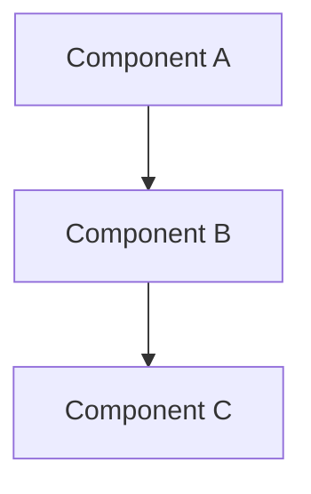

# Design

## Architecture Overview

> High-level description of the system design.



## Data Models

```typescript
interface ExampleModel {
  id: string;
  // ...
}
```

## API Design

### Endpoints / Interfaces

| Method | Path | Description |
|--------|------|-------------|
| GET | /example | Get resource |

## Component Design

### Component 1

- **Responsibility**: 
- **Inputs**: 
- **Outputs**: 

## Design Decisions

| Decision | Rationale | Alternatives Considered |
|----------|-----------|------------------------|
| | | |

## Security Considerations

- Authentication
- Authorization
- Data validation
